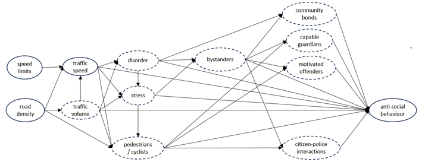

I am currently working on a series of projects exploring the links between motor traffic and criminality, an area of study that [Dr. Thiago Oliveira](https://www.thiagoroliveira.com/) has famously coined as *Carminology*.

As part of a team led by [Prof. Henry Yeomans](https://essl.leeds.ac.uk/law/staff/245/professor-henry-yeomans) I'm working on a project investigating the causes behind the observed decline in drunk driving offences in the UK in the last few decades. For this project we are using historical documents and conducting a representative survey of the British population. The project is funded by the *Interdisciplinary Network for Time* from the [Horizons Institute](https://www.leeds.ac.uk/horizons-institute/doc/challenge-theme-networks) at the University of Leeds.

I am also working with [Dr Toby Davies](https://essl.leeds.ac.uk/law/staff/2554/dr-toby-davies) on a couple of studies estimating the efffect of motor traffic on street crime. For this, we are using open data on road characteristics and longitudinal survey data from Understanding Society. These are the [slides](static/LTN_CCJS.pdf) from a work in progress seminar, and below is the main theoretical framework we are using.

