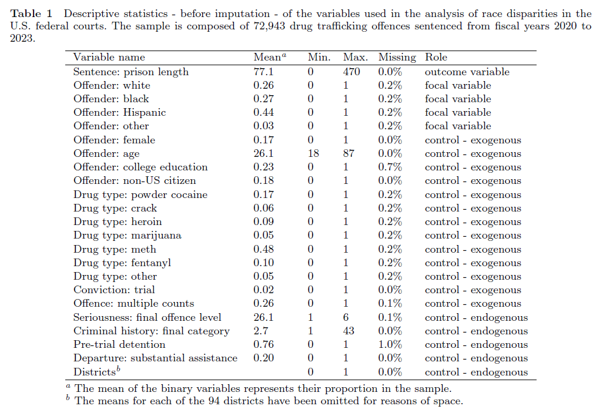
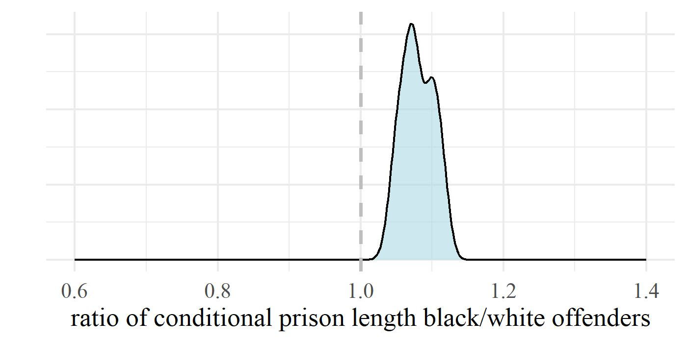
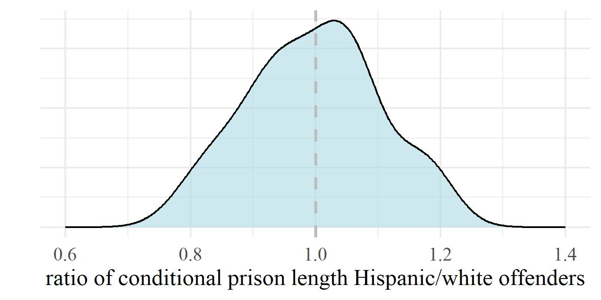

##  {background-image="Justice white_4.jpg" background-size="700px" background-opacity="0.2" background-position="right"}

:::::: {style="text-align: center;"}
::: {style="font-size: 70px; margin-top: 50px; margin-bottom: 50px;"}
<strong>Estimating Discrimination in Sentencing:<br> Distinguishing between Good and Bad Controls</strong>
:::

::: {style="font-size: 40px; margin-top: 50px;"}
Jose Pina-Sánchez, Melissa Hamilton & Peter Tennant
:::

::: notes
Thanks for this invitation. It is my first time in Prague, my father brought me here when I was a kid but that was before of the fall of the Soviet Union and I do not remember anything. It is a real honour, you have something truly special going on in this department of Law and Economics, and it I feel extremely privileged and grateful that you are interested in listening what I have to say on sentencing disparities.
:::
::::::

# Can we estimate sentencing discrimination? {background-image="Justice1.webp" background-size="600px" background-opacity="0.2" background-position="right"}

::: notes
In a given jurisdiction, can we take a representative sample of sentences and estimate the level of discrimination? What do you think? Rise your hand if you think we can. Now those who thing we cant. In this talk I will argue that we can't establish the exact level, that question is unidentifiable, but we can establish where is the most likely level of discrimination, and in certain contexts, establish with enough confidence whether discrimination is present or not.
:::

## You did not control for \[...\]

::: fragment
{width="45%" height="45%" fig-align="center"}
:::

::: {.fragment style="margin-top: -30px;" data-sound="/static/sounds/tadaa_long.mp3"}
{width="45%" height="45%" fig-align="center"}
:::

::: {style="margin-top: -30px;"}
-   If you believe in the principle of individualisation, the list of controls is infinite
:::

::: notes
The perennial problem: always pointed out to studies exploring disparities using observational data. Case characteristics refer to the legal factors that are expected to affect sentence severity. Offender's socio-demographic trait refer to the specific personal trait under investigation (race, gender, social class, etc.) Demonstration of how the bias can creep in using the DAG. The corollary is that reviewers, critiques, will often point at factors that affect sentence severity that you forgot to include.
:::

## Missing legal factors can be ok

-   Diminishing returns of explainability for every additional factor

-   Confounding bias requires association with the focal variable

-   Sometimes the observed disparities are just too big

::: notes
Using the top-20 rather than the top-10 legal factors does not affect predictive accuracy in sentencing. This is from a study exploring shoplifting offences in the magistrates' court in England and Wales. When we use the top-10 factors influencing the probability of receiving a prison sentence we can classify correctly 80.1% of cases. Can you guess how many more cases could we predict correctly after doubling the number of legal factors to introduce the top-20 case characteristics? 81.2%. Even if there was an important factor affecting sentence severity that we failed to control for, that is just a necessary, not a sufficient condition. Confounding bias requires association with the focal variable abd for that association to point in a given direction E.g. In England white offenders have longer previous convictions than anyone else The needed strength of the missing factor with both the cause (race, gender, etc.) and the effect (sentence severity) is inversely proportional to the size of the observed disparities. We can determine the necessary dimension of the missing factor to render them non-significant We know smoking causes cancer even though we have no experimental evidence. The corollary from this first part of my talk is that confounding bias might always be present, making the identification of the precise degree of discrimination unidentifiable, however, there are instances where, under certain conditions, we can claim confidently enough that discrimination is present.
:::

# What if we were 'overcontrolling'? {.graph-slide data-sound="/static/sounds/epic_dune.wav"}

::: notes
I am going to bring up a 2nd problem, which is the focus of my paper. Should we be controlling for all legal factors?
:::

## A more realistic representation

::: {.fragment style="margin-top: -10px;"}
{width="70%" height="70%" fig-align="center"}
:::

::: {.fragment style="margin-top: -40px;"}
{width="70%" height="70%" fig-align="center"}
:::

::: {style="margin-top: -40px;"}
-   Target estimand: the effect of judicial prejudice on sentencing

-   Proxy estimand: the effect of offender's socio-demographic trait on sentencing, not mediated through warranted differences
:::

::: notes
A more realistic representation of sentencing. We have added two nodes that are latent (unobserved), judicial prejudice and deliberation. Deliberation captured the moment where all the information is put into the judge's head. And judicial prejudice refers to the hypothetical prejudice that might arise when the judge finds out the offender's race or gender or social class (or whatever you are interested on). Proxy estimand: the effect of offender's socio-demographic trait on sentencing, not mediated through warranted differences
:::

## Judicially-defined case characteristics

::: fragment
{width="90%" height="90%" fig-align="center"}
:::

::: {.fragment style="margin-top: -30px;"}
{width="90%" height="90%" fig-align="center"}
:::

::: {style="margin-top: -30px;"}
-   Pick your poison
:::

::: notes
Not all case characteristics are exogenous to the judge. Same graph, only now I have split case characteristics in two. Explain the problem of post-treatment bias. Explain the problem of confounding bias that lingers if we do not control for judicially-defined case characteristics. Criminologists tend to control for these factors, econometricians have started to choose not to control for them. Pick your poison kind of situation. What would you do? Our view is to do both, run models with and without this kind of endogenous factors and take them both as potentially valid.
:::

## Other offender characteristics

::: {.fragment style="margin-top: -40px;"}
{width="70%" height="70%" fig-align="center"}
:::

::: {.fragment style="margin-top: -50px;"}
{width="70%" height="70%" fig-align="center"}
:::

::: {style="margin-top: -50px;"}
-   Estimating discrimination requires accuracy
:::

::: notes
We prefer unhelpful concepts like 'unwarranted disparities'
:::

## Judge characteristics

::: {.fragment style="margin-top: -20px;"}
{width="70%" height="70%" fig-align="center"}
:::

::: {.fragment style="margin-top: -40px;"}
{width="70%" height="70%" fig-align="center"}
:::

::: {style="margin-top: -50px;"}
-   Useful to explore the origin of disparities, but that is a different question
:::

::: notes
not so helpful when estimating the presence of discrimination.
:::

## Court/area characteristics

::: {.fragment style="margin-top: -30px;"}
{width="70%" height="70%" fig-align="center"}
:::

::: {.fragment style="margin-top: -40px;"}
{width="70%" height="70%" fig-align="center"}
:::

::: {style="margin-top: -40px;"}
-   Another set of endogenous factors
:::

::: notes
Another chance to pick your poison
:::

# A new modelling framework {.graph-slide data-sound="/static/sounds/horn_circus.wav"}

::: notes
In the article we carry on reviewing the causal role of non-legal factors, like offender, judge, and court characteristics, identifying similar issues, but I will spare you the boredom. What we also try to do is be constructive, rather than just say it is all crap, try to facilitate a way to reflect the model uncertainty that stems from these types of problems.
:::

## Step-1: Define the target estimand

-   State the specific effect you seek to estimate

    -- if interested in direct discrimination then say so

-   Clearly state the population of interest

    -- decision-makers and decision stages under analysis

::: notes
The concept of unwarranted disparities is really vague. If we care about discrimination then we say so. And if we mean direct discrimination then we say so too. If you prefer the potential outcomes framework, another way to put this is as the average difference in sentence severity were we to modify offender's race. Crucially, we need to identify the decisions to be studied to avoid selection bias, and the decision-makers under analysis as that will have implications regarding what we consider to be endogenous case characteristics. On decisions, the issue of jurisdictions where both decisions of conviction and sentence severity are imposed by the same body of judges. There, if we are exploring discrimination in judicial decision-making by focusing just on the sentences imposed ignoring those who were found not guilty, then we are most likely going to have a problem of selection bias. On decision-makers, in the US is quite normal to sentence through guilty negotiations between prosecutors and offenders. If we want to explore those sentences too, then we need to expand our list of judicially-defined case characteristics. It is not anymore case characteristics which are influenced by a potential judicial prejudice, but now also those influenced by prejudice from prosecutors.
:::

## Step-2: Operationalise sentence severity

-   Do you consider adjudication?

-   Do you consider non-custodial sentences?

-   Is sentencing a one- or two-stage process?

## Step-3: List and classify the necessary controls

-   Identify all the relevant legal factors

-   Classify them as judicially-defined or not

-   Identify non-legal factors influencing sentence severity

-   Note which ones are missing

::: notes
Relevant legal factors or case characteristics are those listed in the criminal code. A lot easier to do if you consider offence-specific models, rathen than general samples of offences.
:::

## Step-4: Estimate model uncertainty

-   Regarding endogenous factors

    -- compare models with and without them

-   Regarding unobserved legal/non-legal factors

    -- E-value (VanderWeele & Ding, 2017)

    -- Robustness value (Cinelli & Hazlett, 2020)

::: notes
There is not perfect combination of controls, therefore there is not a perfect answer, but we can sill estimate the model uncertainty that arises when we control or fail to control for case characteristics that are subjectively defined by the judge. So, let's run all possible combinations and uncover how much uncertainty there is as a result of that problem.
:::

## US federal courts: controls

::: {.fragment style="margin-top: -10px;"}
{width="80%" height="80%" fig-align="center"}
:::

## US federal courts: findings

::: {.fragment style="margin-top: -10px;"}
{width="50%" height="50%" fig-align="center"}
:::

::: {.fragment style="margin-top: -40px;"}
{width="50%" height="50%" fig-align="center"}
:::

::: notes
Drug trafficking offences.
:::

## Conclusion

-   The precise level of discrimination in sentencing is unkowable

-   Yet, in certain contexts, we can establish its presence/absence

-   We need to embrace uncertainty

-   The best way to fight scientific nihilism

::: notes
we should distrust studies presenting a point estimate.
:::

## Next Steps

-   Open research

    -- reduce researchers' degrees of freedom through pre-registrations

    -- eliminate publication bias through registered reports

-   Sensitivity analysis for unobserved mediators

    -- combine different types of model uncertainty

-   A comprehensive framework for the estimation of discrimination

    -- beyond sentencing, applicable to any decision-making process

::: notes
Whoever does this provides a comprehensive framework for the estimation of discrimination If you know any stats genius who can do this let me know
:::

```{=html}
<!--
I do not want you to walk away with a feeling of despair, quite the opposite.
I hope I have shown that research questions are often harder than we think, 
but that is no reason to simply give up, embrace scientific nihilism or social constructivism and say there is no truth, or it is unknowable.
and maybe contribute to make the world a better a place.
# If we try hard enough, and do not fool ourselves along the way, we can answer pretty difficult questions
-->
```

```{=html}
<script>
document.addEventListener("DOMContentLoaded", function() {
  if (window.Reveal) {

    // 🔊 Play sound when a fragment appears
    Reveal.addEventListener('fragmentshown', function(event) {
      const soundSrc = event.fragment.dataset.sound;
      if (soundSrc) {
        const audio = new Audio(soundSrc);
        audio.play();
      }
    });

    // 🔊 Play sound when a slide becomes active
    Reveal.addEventListener('slidechanged', function(event) {
      const soundSrc = event.currentSlide.dataset.sound;
      if (soundSrc) {
        const audio = new Audio(soundSrc);
        audio.play();
      }
    });
  }
});
</script>
```
