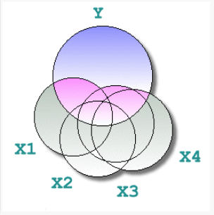

##  {background-image="Justice white_4.jpg" background-size="700px" background-opacity="0.2" background-position="right"}

:::::: {style="text-align: center;"}
::: {style="font-size: 70px; margin-top: 50px; margin-bottom: 50px;"}
<strong>Introducción al estudio cuantitativo del “sentencing”<br> *(imposición de penas)*</strong>
:::

::: {style="font-size: 40px; margin-top: 50px;"}
Jose Pina-Sánchez
:::

::: notes
Gracias por la invitacion. Sentencing entendido como el proceso de toma de decisions por parte de el juez o la judicatura.
:::
::::::

## Delimitando objetivos

-   Múltiples preguntas de investigación

    -- ¿Cuál es el grado de consistencia entre juzgados?

    -- ¿Cuál es el nivel de punitividad/proporcionalidad/ individualización en el sistema?

    -- ¿Existe discriminación por razones de raza?

    -- ¿Cuál ha sido el efecto de la última ley orgánica?

-   Múltiples diseños de estudio

    -- ¿Experimental u observacional?

    -- ¿Longitudinal o de sección cruzada?

::: notes
Cual es el nivel de proporcionalidad, punitividad, individualización en las penas.

Estos métodos pueden ser mas o menos útiles según la pregunta de investigación.
:::

## Delimitando objetivos

-   Múltiples métodos de recogida de datos

    -- observaciones en juzgados

    -- datos de la administración (e.g. [Data First](https://www.adruk.org/data-access/flagship-datasets/data-first-cross-justice-system-england-and-wales/))

    -- encuestas a jueces (e.g. [Crown Court Sentencing Survey](https://sentencingcouncil.org.uk/research-data/our-research-and-analysis/sentencing-council-courts-data/))

    -- revisión de sentencias (e.g. [CENDOJ](https://www.poderjudicial.es/search/indexAN.jsp))

-   [Pregunta]{style="color:red; text-decoration: underline;"}: Cuáles son los pros y contras de cada método?

-   En este mini-curso: datos de sección cruzada para estimar el efecto de factores (legales y extra-legales) en la punitivad

::: notes
He elegido este ejemplo porque esto representa el estudio tipico de sentencing.
:::

## Aproximación a nivel conceptual

-   Buscamos estimar el efecto causal de un factor de interés en la severidad de las penas impuestas

    -- ¿En qué medida la declaración de culpabilidad reduce la pena?

    -- ¿Qué peso se le da al historial delictivo del acusado?

    -- ¿Existe discriminación judicial por razones de aporofobia?

    -- ¿Se aplica el mitigante por arrepentimiento de manera diferente según el sexo del delincuente?

::: notes
Voy a presentar primero el problema a nivel conceptual, en forma de introduccion, para luego tratar de entrar de lleno de manera mas practica.
:::

## ¿Problemas?

-   No existe un indicador de la severidad de las penas

-   Sesgo de confusión

    -- la correlación de interés puede ser espúrea (causada por un tercer factor)

-   Otros: sesgo de postratamiento, datos ausentes, errores de medida, etc.

## Operacionalizar la severidad

-   Diferentes tipos de sentencias basados en diferentes medidas

    -- multa (€), sanción comunitaria (condiciones), prisión (meses)

-   Escalas (subjetivas) de severidad [(Pina-Sánchez & Gosling, 2020)](https://jmpinasanchez.github.io/static/PinaSanchez.2020.TacklingSelectionBiasInSentenc.pdf)

::: {.fragment style="margin-top: -30px;"}
{width="85%" height="85%" fig-align="center"}
:::

::: notes
Otorgando a cada sentencia un valor subjetivo de severidad.
:::

## Operacionalizar la severidad

-   Opciones menos complejas

    -- binaria: prisión o no

    -- duración de las penas de prisión

-   [Pregunta]{style="color:red; text-decoration: underline;"}: Cuáles son las ventajas e inconvenientes?

    -- ¿Cuál es el problema de basarnos en la duración de las penas de prisión?

    -- ¿Cuál es el problema de usar medidas de severidad simples en lugar de una escala de severidad?

## Sesgo de confusión {.graph-slide data-sound="/static/sounds/epic_dune.wav"}

::: fragment
{width="55%" height="55%" fig-align="center"}
:::

::: {style="margin-top: -30px;"}
-   Necesitamos controlar por otras caractéristicas del caso

    -- métodos de emparejamiento

    -- métodos de regresión
:::

::: notes
Este es realmente el kit de la cuestion. Encontrar maneras de codificar las caracteristicas del caso, para luego poder controlar por estas caracteristicas en nuestros modelos estadisticos, y con ello poder aislar, o identificar el efecto causal de interes.
:::

## Modelos de regresión

-   [ Correlación entre dos variables controlando por otras variables ]{.fragment data-sound="/static/sounds/tadaa_long.mp3"}

::: {.fragment style="margin-top: -10px; margin-bottom: -30px;"}
{width="35%" height="35%" fig-align="center"}
:::

::: fragment
$$Y_i=\beta_0+\beta_1X_{1,i}+\beta_{k}X_{k,i}+\epsilon_i$$
:::

```{=html}
<!--

## Análisis de moderación y mediación

- Moderación: el efecto de interés es heterogéneo

  -- ¿Se aplica la mitigación por 'buen carácter' de manera diferente a hombres y mujeres?  
  
- Mediación: distinguimos efectos directos e indirectos

  -- ¿Es posible que las disparidades de raza estén mediadas por la construcción del caso? [(Guilfoyle & Pina-Sánchez, 2024)](https://academic.oup.com/bjc/article/65/2/241/7708313?login=false)

-->
```

## Aplicar controles de manera crítica

::: fragment
{width="45%" height="45%" fig-align="center"}
:::

::: {.fragment style="margin-top: -30px; margin-bottom: -30px;"}
{width="90%" height="90%" fig-align="center"}
:::

-   No es buena idea controlar por todas las caráctesticas del caso

-   No podemos estimar con exactitud el nivel de discriminación [(Pina-Sánchez et al., 2025)](https://publicera.kb.se/ejels/article/view/53977)

## Tests de robustez

-   Supuesto de normalidad

    -- análisis de residuos

-   Datos ausentes

    -- imputación múltiple [(Van Buuren, 2018)](https://stefvanbuuren.name/fimd/)

-   Variables perfectamente medidas

    -- SIMEX [(Cook & Stefanski, 1994)](https://www.jstor.org/stable/2290994)

-   Sesgo de confusión

    -- Robustness value [(Cinelli & Hazlett, 2020)](https://rss.onlinelibrary.wiley.com/doi/abs/10.1111/rssb.12348)

## Práctica en R

-   Descargar e instalar [R](https://cran.r-project.org/bin/windows/base/) y [Rstudio](https://posit.co/download/rstudio-desktop/)

    -- en ese orden

-   Descargar el archivo de datos ['Main dataset'](https://sentencingcouncil.org.uk/research-data/our-research-and-analysis/sentencing-council-courts-data/offence-specific-data-collections/robbery/)

    -- tomad nota de la dirección de la carpeta donde se descarga

-   Pregunta de investigación

    -- ¿Existe discriminación por género?

    -- [Robbery Sentencing Guidelines](https://sentencingcouncil.org.uk/guidelines/robbery-street-and-less-sophisticated-commercial/?source=7511)

```{=html}
<script>
document.addEventListener("DOMContentLoaded", function() {
  if (window.Reveal) {

    // 🔊 Play sound when a fragment appears
    Reveal.addEventListener('fragmentshown', function(event) {
      const soundSrc = event.fragment.dataset.sound;
      if (soundSrc) {
        const audio = new Audio(soundSrc);
        audio.play();
      }
    });

    // 🔊 Play sound when a slide becomes active
    Reveal.addEventListener('slidechanged', function(event) {
      const soundSrc = event.currentSlide.dataset.sound;
      if (soundSrc) {
        const audio = new Audio(soundSrc);
        audio.play();
      }
    });
  }
});
</script>
```
